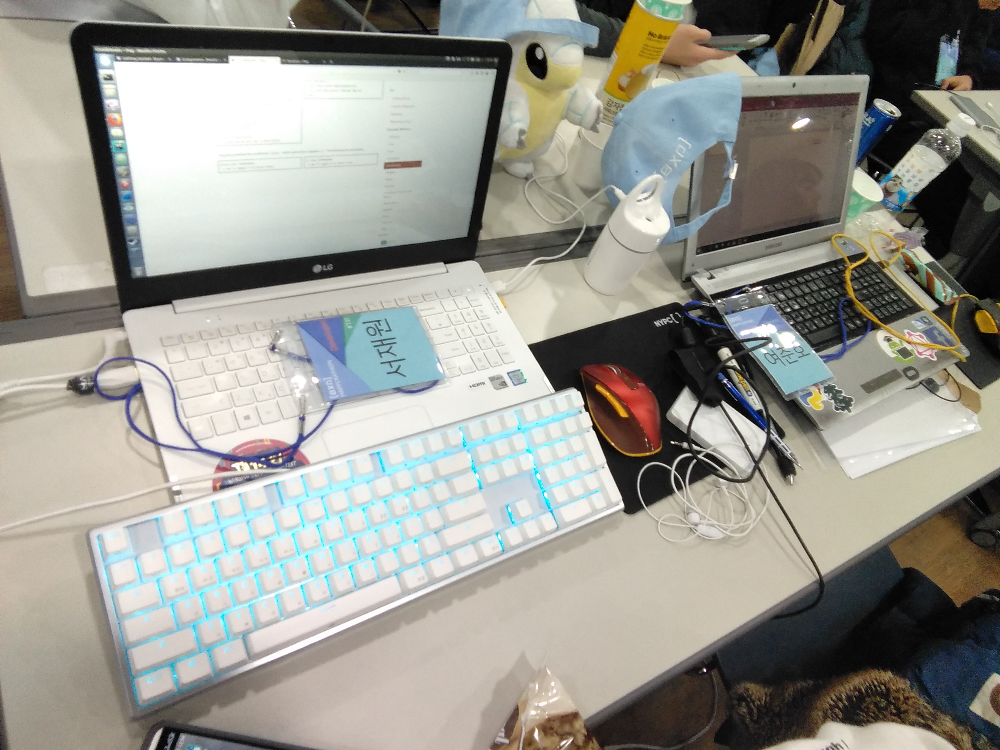
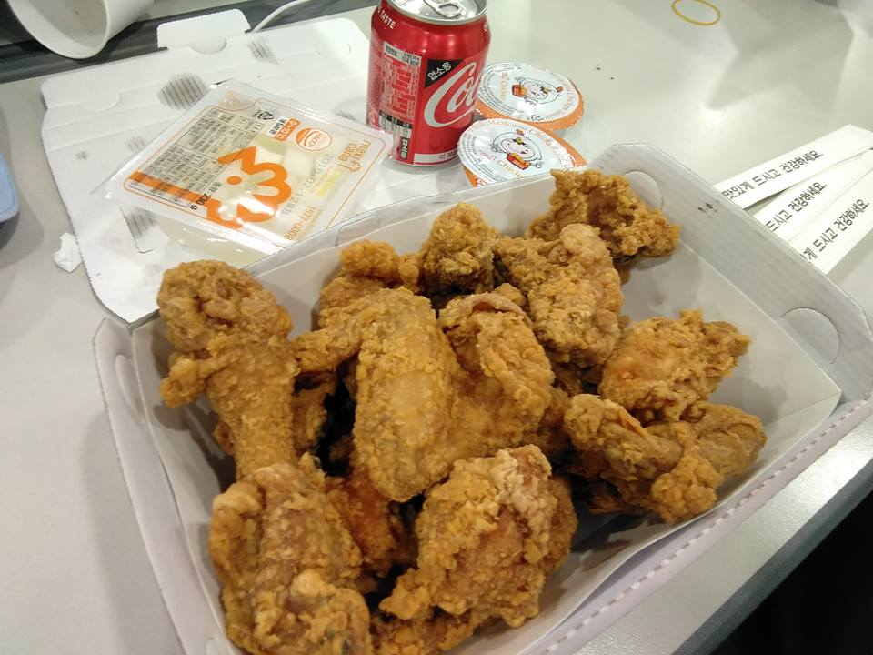
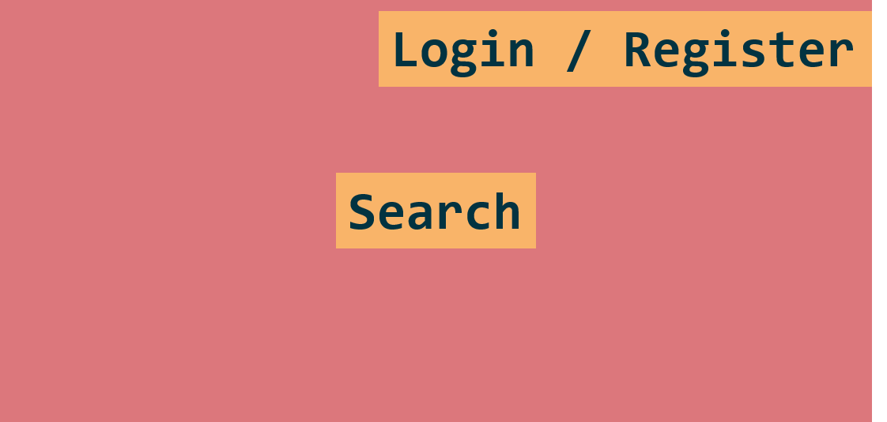
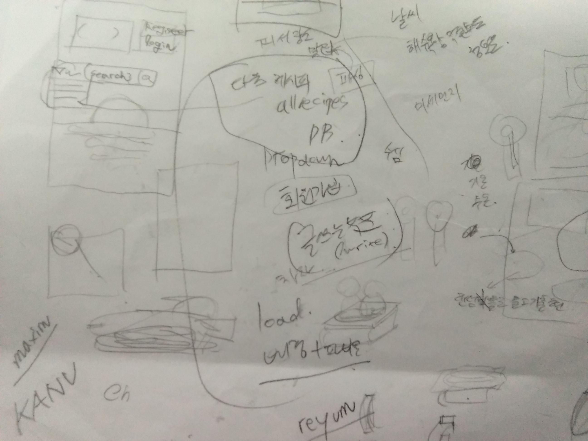
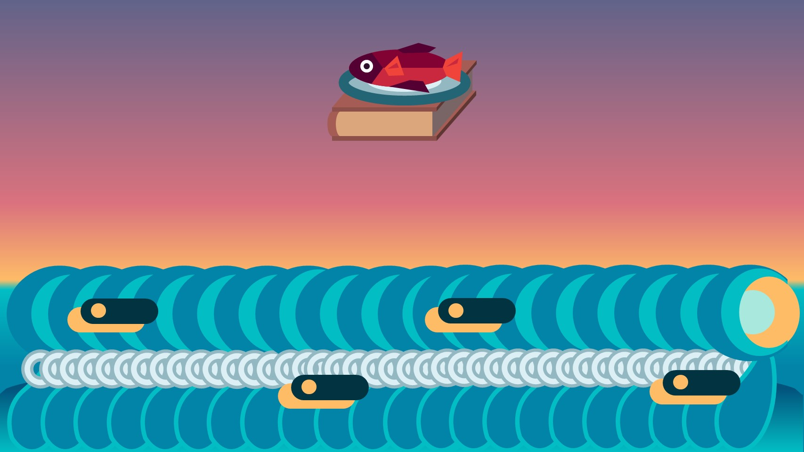
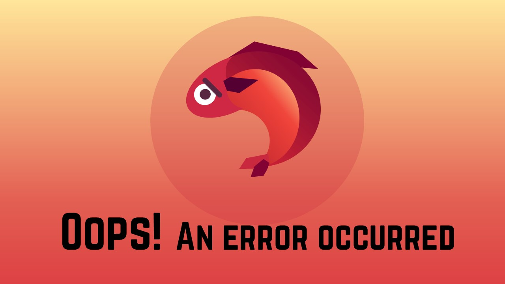
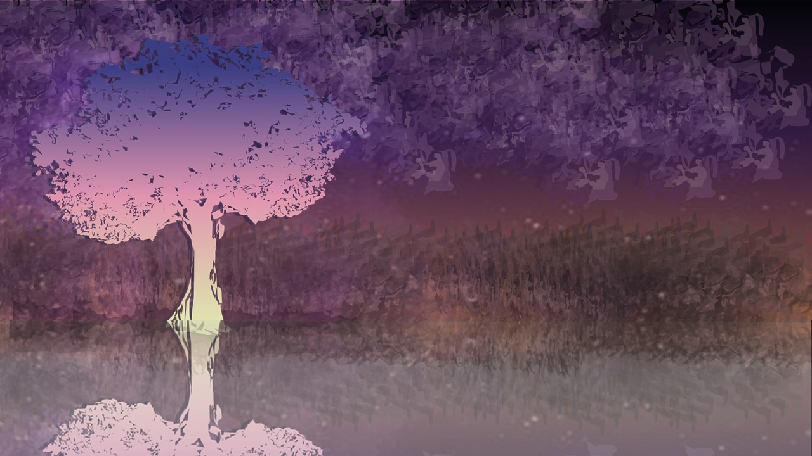
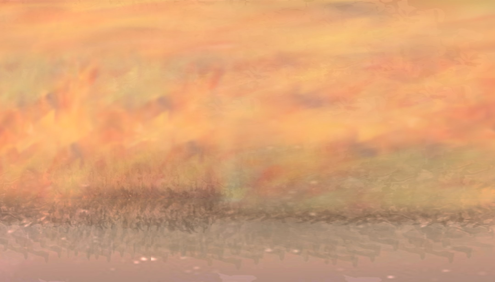
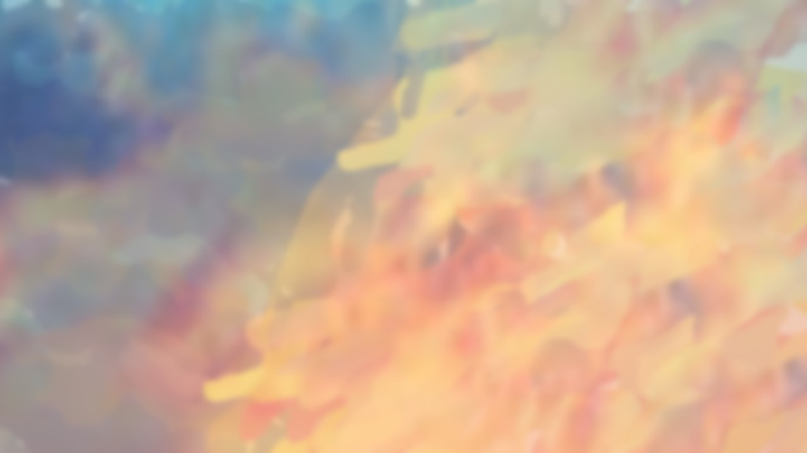
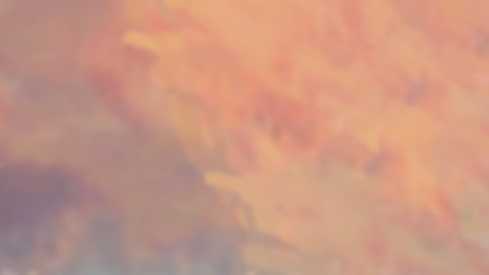

# 0XD happckathon 2018 - ```ReSeaPe```

## Team
</br>
> 저기 노트북 사이에 모자를 쓰고 계신 수석 개발자 분이 보이죠?

#### Developer : 서재원</br>

- 레씨피 프로젝트 기획 + <strong>전체 개발</strong></br>

- JavaScript 전도자

- https://github.com/ENvironmentSet

#### Designer : 여준호</br>

- ~~기획자로 왔는데 결국~~ 전체 디자인</br>

- 새벽의 팝콘ㅡ셔틀 ~~개발자님 충성^^7~~</br>

- https://github.com/JunhoYeo

## 2인팀 만스에
</br>
> 2인팀은 위대합니다.

- 팀당 한마리의 <strong>치킨(야식)</strong>, 1/2로 분배가능</br>
~~심지어 배불러서 기부함~~

- 화기애애한 분위기(?)

- 서로 의지하면서 개발할 수 있어용

- 잠자는 개발자를 위해 군대송+핑크퐁을 틀어주는 친절한 서비스 존재</br>
~~개때릴뻔했다네요~~

근데 왜 눈물이 나는 걸까요?

## Naming
<h3>```Recipe + Sea(주제) = ReSeaPe(ReSEApe)```</h3></br>
한국어로는 '레씨피'로 표기합니다 / '레씨피' in Korean</br>
~~누가 지었는진 몰라도 참 잘 지었네~~ ~~히히 대체 누구지?~~

## Sketch
</br>
> 대충 이런 스톼일로 생각했습니다.</br>

</br>
> 급해서 ~~과연~~ 글씨가 이상하지만 뭐 햅커톤에서는 이렇게 종이에 스케치를 했습니다.

## Download
</br>
> Repository of <strong>ENvironmentSet</strong>(ReSeaPe Developer)</br>

https://github.com/ENvironmentSet/ReSeaPe</br>
ReSeaPe의 개발자 ENvironmentSet(서재원/환경설정)의 저장소입니다.</br>
해당 저장소에서 ReSeaPe의 다운로드 및 실행이 가능합니다.</br>
~~Star 하나씩 박고가세요!~~

## PPT(Presentation)
look at ```ReSeaPe_Design/presentation``` or </br>
> Microsoft PowerPoint 2016 환경에서 제작되었습니다.

모핑떡칠 + Adobe Color CC 색조합</br>
아래에서 슬라이드 이미지를 확인할 수 있습니다.</br>
</br>
</br>
</br>
</br>
</br>
</br>
</br>
</br>
</br>
</br>
</br>
</br>
</br>
</br>
</br>
</br>
</br>
</br>
</br>
</br>

## Favicon(Logo)
</br>
레시피 + <strong>바다</strong> => 해산물(생선) 요리

## Web Application Resources
</br>
> 메인 페이지 백그라운드

</br>
> 로그인 페이지 백그라운드

</br>
> 회원가입 페이지 백그라운드

</br>
> 에러 페이지 백그라운드

</br>
> 리다이렉션 페이지 백그라운드

</br>
> 레시피 목록 페이지 백그라운드

</br>
> 레시피 페이지 백그라운드

</br>
> 레시피 작성 페이지 백그라운드

</br>
> 레시피 수정 페이지 백그라운드

## 만약 디자이너가 심심하면
저걸로 뭔가 이상한 걸 더 만들 수도 이써욤 ~~참고로 제 계좌번호는요~~

## Thanks
서재원씨 사랑해요!! (떡로고 만들어드린걸로 제 마음, 표현해드리죠)

#### 심사위원 분들께서 주신 소중한 피드백
Markdown 등으로 레시피를 작성할 수 있었으면 좋았을 것 같으셨다고 말씀해 주셨습니다! 감사합니다 <3</br>
+) 햅커톤 종료 후에 주신 명함 감사합니다(소중히 간직중)

#### 참여해주신 멘토분들도
많은 도움 주셔서 감사합니다!

#### 주최측 분들과 다른 참가자 여러분들께
감사합니다! 정말 좋은 시간이였습니다 :)</br>
저는 더 열심히 공부해야겠네요 ㅠㅠ
